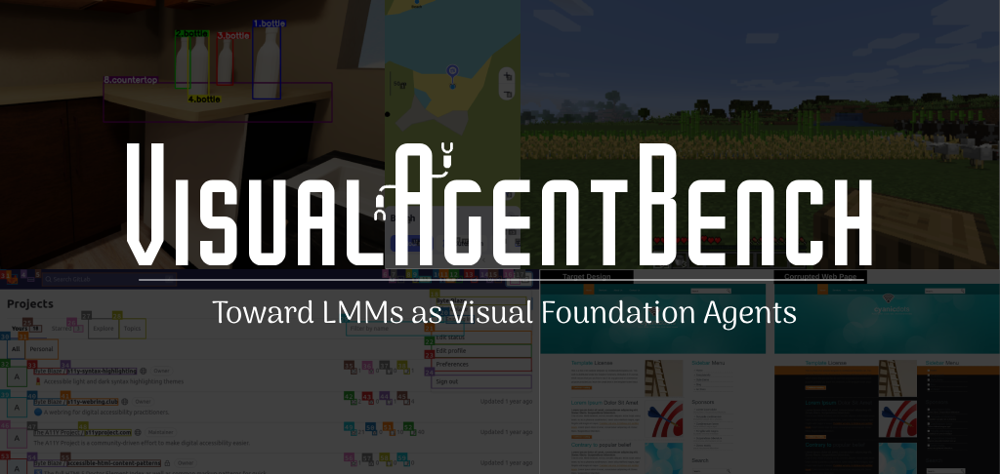
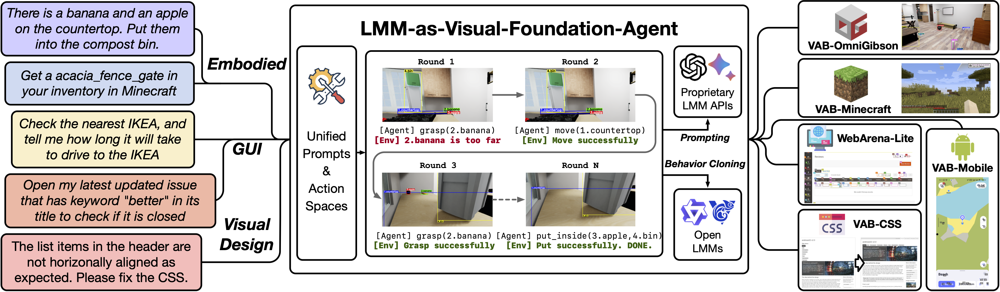
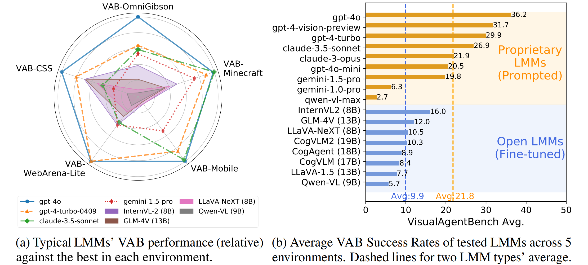
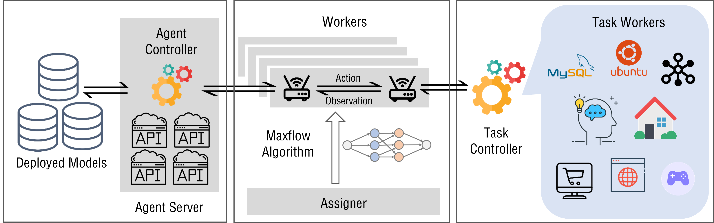
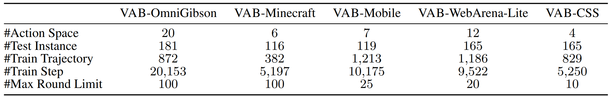
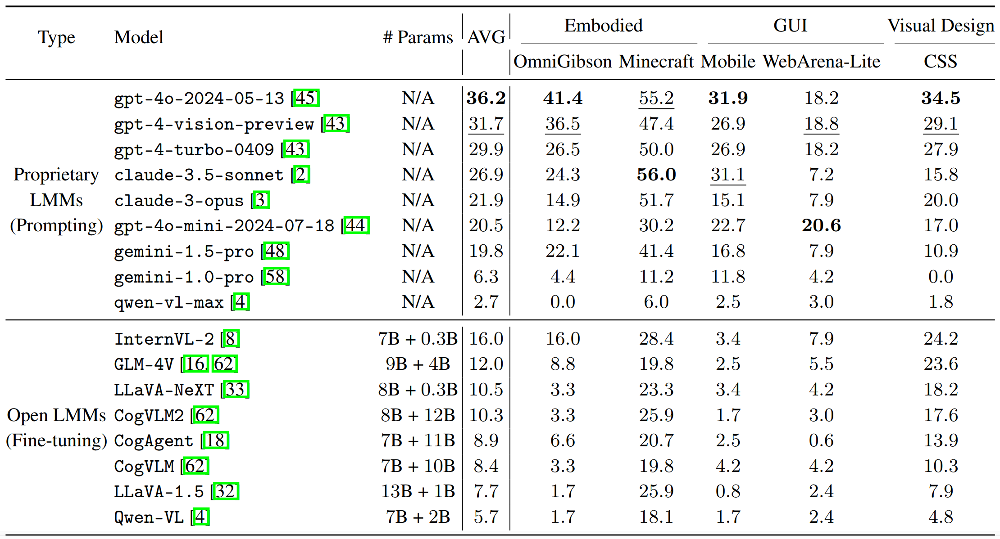

# VisualAgentBench (VAB)



<p align="center">
   <a href="" target="_blank">🌐 Website</a> | <a href="https://arxiv.org/abs/2408.06327" target="_blank">📃 Paper </a> | <a href="" target="_blank"> 🗂️ VAB Training (Under Construction)
</p>

# VisualAgentBench: Towards Large Multimodal Models as Visual Foundation Agents

**VisualAgentBench (VAB)** is the first benchmark designed to systematically evaluate and develop large multi models (LMMs) as visual foundation agents, which comprises 5 distinct environments across 3 types of representative visual agent tasks (Embodied, GUI, and Visual Design)

https://github.com/user-attachments/assets/4a1a5980-48f9-4a70-a900-e5f58ded69b4

- VAB-OmniGibson (Embodied)
- VAB-Minecraft (Embodied)
- VAB-Mobile (GUI)
- VAB-WebArena-Lite (GUI, based on [WebArena](https://github.com/web-arena-x/webarena) and [VisualWebArena](https://github.com/web-arena-x/visualwebarena))
- VAB-CSS (Visual Design)

Compared to its predecessor [AgentBench](https://github.com/THUDM/AgentBench), VAB highlights visual inputs and the enabling of **Foundation Agent** capability development with training open LLMs/LMMs on trajectories. 





## Table of Contents

-   [Quick Start](#quick-start)
-   [Dataset Summary](#dataset-summary)
-   [Leaderboard](#leaderboard)
-   [Quick Start](#quick-start)
-   [Acknowledgement](#acknowledgement)
-   [Citation](#citation)

## Quick Start

This section will first give you an overview to the use and architecture of VAB.
Next, it will guide you on how to use `gpt-4o-2024-05-13` as an exemplar agent to launch 4 concurrent `VAB-Minecraft` tasks.

### Overview on VAB Framework

To allow fast evaluation over agent tasks, we leverage AgentBench's framework as the backbone (currently for VAB-OmniGibson, VAB-Minecraft, and VAB-CSS).
If you are interested in its detailed implementation, please refer to AgentBench's [Framework Introduction](https://github.com/THUDM/AgentBench/blob/main/docs/Introduction_en.md) (which may not be necessary).
Basically, the framework calls all LLM/LMM in API formats via `Agent-Controller`, and accesses to environments via `Task-Controller`.
The `Assigner` will automatically assign evaluation tasks by pairing `Agent-Controller` and `Task-Controller` to optimize the overall evaluation speed.
For more detailed configuration and launch methods, please check [Configuration Guide](docs/Config_en.md)
and [Program Entrance Guide](docs/Entrance_en.md).



### Step 1. Prerequisites for All Environments

Clone this repo and install the dependencies.

```bash
cd VisualAgentBench
conda create -n vab python=3.9
conda activate vab
pip install -r requirements.txt
```

Ensure that [Docker](https://www.docker.com/) is properly installed.

```bash
docker ps
```

For specific environments, please refer to their additional prerequisites respectively.
For VAB-WebArena-Lite, it is based on [WebArena](https://github.com/webarena-x/webarena) with some modifications, so please read its individual setup carefully.

* [VAB-OmniGibson Setup](docs/detailed_setups/VAB-OmniGibson.md)
* [VAB-Minecraft Setup](docs/detailed_setups/VAB-Minecraft.md)
* VAB-Mobile: Ongoing
* [VAB-WebArena-Lite Setup](VAB-WebArena-Lite/README.md) (Separate installation and evaluation method)
* VAB-CSS: Ongoing

### Step 2. Configure the Agent

Fill in your OpenAI API Key at the correct location in `configs/agents/openai-chat.yaml`.

You can try using `python -m src.client.agent_test` to check if your agent is configured correctly.


### Step 3. Start the task server

Starting the task worker involves specific tasks. Manual starting might be cumbersome; hence, we provide an automated script.

The assumption for this step is that ports from 5000 to 5015 are available. For Mac OS system, you may want to follow [here](https://stackoverflow.com/questions/69955686/why-cant-i-run-the-project-on-port-5000) to free port 5000 to use.

```bash
python -m src.start_task -a
```

This will launch 4 task_workers for `VAB-Minecraft` tasks and automatically connect them to the controller on port 5000. **After executing this command, please allow approximately 1 minute for the task setup to complete.** If the terminal shows ".... 200 OK", you can open another terminal and follow step 4.

### Step 4. Start the assigner

This step is to actually start the tasks.

If everything is correctly configured so far, you can now initiate the task tests.

```bash
python -m src.assigner --auto-retry
```

### Next Steps

If you wish to launch more tasks or use other models, you can refer to the content in [Configuration Guide](docs/Config_en.md) and [Program Entrance Guide](docs/Entrance_en.md).

For instance, if you want to launch VAB-OmniGibson tasks, in step 3:

```bash
python -m src.start_task -a -s omnigibson 2
```

In step 4: 

```bash
python -m src.assigner --auto-retry --config configs/assignments/omnigibson.yaml
```

You can modify the config files to launch other tasks or change task concurrency.

## Dataset Summary

We offer two splits for each dataset: Testing and Training. Different from its predecessor [AgentBench](https://github.com/THUDM/AgentBench), VAB is accompanied with a trajectory training set for behavior cloning (BC) training, which allows development of more potent visual foundation agents with emerging open LMMs.



## Leaderboard

Here is the scores on test set results of VAB. All metrics are task Success Rate (SR). Noted that proprietary LMMs are tested with mere **Prompting**, and open LMMs are tested after **Multitask Finetuning** on VAB training set, as they usually fail to follow complicated agent task instructions.




## Acknowledgement
This project is heavily built upon the following repositories (to be updated):

* [AgentBench](https://github.com/THUDM/AgentBench): which serves as the backbone framework of this project for efficient and reliable parallel agent evaluation.
* [WebArena](https://github.com/web-arena-x/webarena) and [VisualWebArena](https://github.com/web-arena-x/visualwebarena): which serve as the testing framework and data source for VAB-WebArena-Lite dataset.
* [OmniGibson](https://github.com/StanfordVL/OmniGibson): which serves as the environment for VAB-OmniGibson.
* [JARVIS-1](https://github.com/CraftJarvis/JARVIS-1): VAB-Minecraft's framework is adapted from JARVIS-1's pipeline.
* [STEVE-1](https://github.com/Shalev-Lifshitz/STEVE-1): which serves as the action executor for VAB-Minecraft.

## Citation

```
@article{liu2024visualagentbench,
  title={VisualAgentBench: Towards Large Multimodal Models as Visual Foundation Agents},
  author={Liu, Xiao and Zhang, Tianjie and Gu, Yu and Iong, Iat Long and Xu, Yifan and Song, Xixuan and Zhang, Shudan and Lai, Hanyu and Liu, Xinyi and Zhao, Hanlin and others},
  journal={arXiv preprint arXiv:2408.06327},
  year={2024}
}
```
